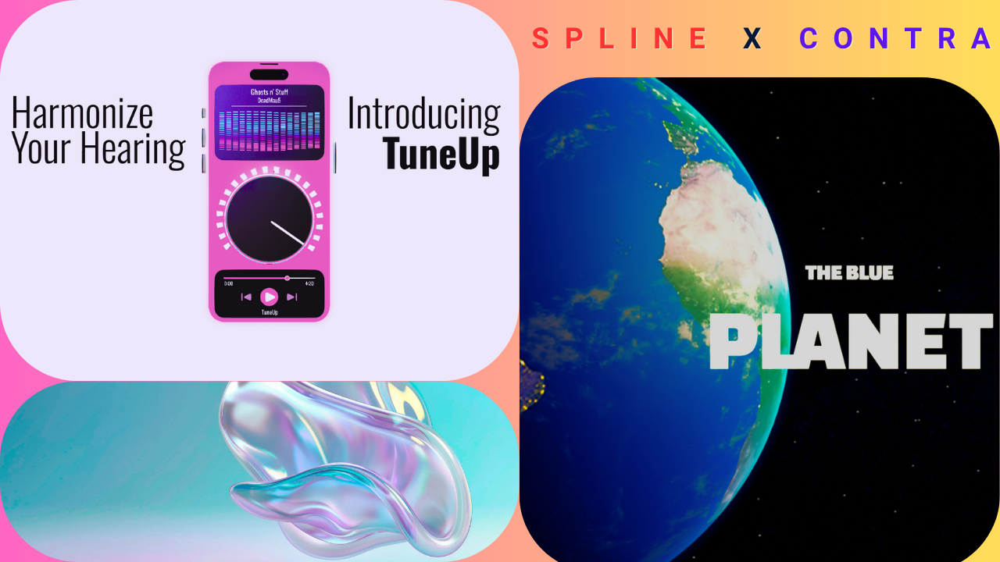

# 🎨 SPLINE X CONTRA HACKATHON 2025

## 🚀 Overview

This project was created as part of the **Spline X Contra Hackathon**, where I built **two interactive and visually immersive websites** by combining **Spline**, **Hana**, and **Webflow**. The focus was on merging creativity with interactivity, delivering both aesthetic appeal and functional storytelling through modern web technologies.

---

## 🌐 Projects

### 🎧 1. TuneUp — Vibrant Harmonize Website
A lively and animated web experience inspired by the rhythm and flow of music. Built with **Spline** and **Hana**, TuneUp captures the essence of musical harmony through vibrant 3D design and smooth transitions.

Link - https://tuneup.webflow.io/

- 🌈 Features:
  - Bright, animated visual themes
  - Interactive 3D elements via Spline
  - Seamless integration with Webflow and Hana for responsiveness

---

### 🌍 2. The Blue Planet Earth — 3D Earth Experience
A realistic, **revolving 3D representation of Earth** designed to showcase the planet’s natural beauty. This project highlights environmental elements and uses motion to create an engaging educational and visual experience.

- 🌎 Features:
  - Fully rotatable 3D globe made in Spline
  - Representations of nature (land, water, air)
  - Informative hover zones and dynamic lighting

---

## 🎥 Screenshot

---

## 🔧 Tech Stack

- Spline
- Hana
- Webflow

---

## 🏁 Outcome

Successfully built two distinct web experiences that explore how **3D design and modern web tools** can be used to tell stories, educate, and entertain all in the browser.
